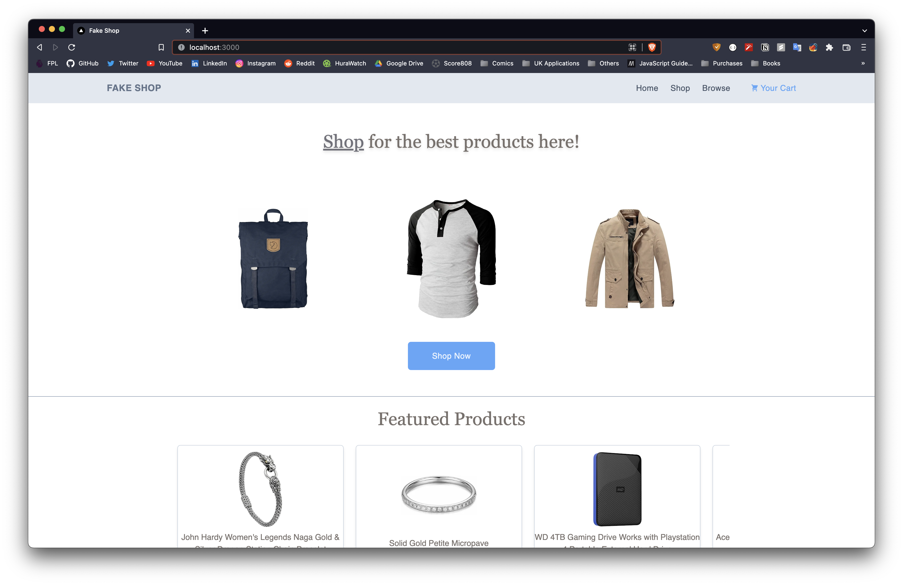
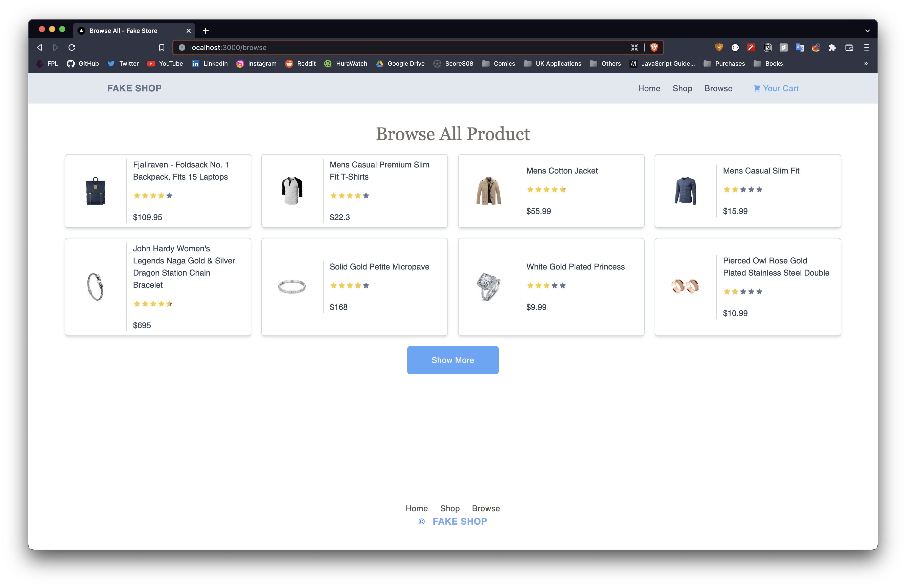
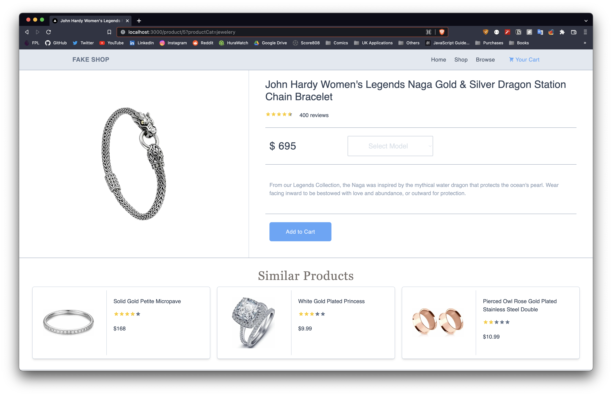
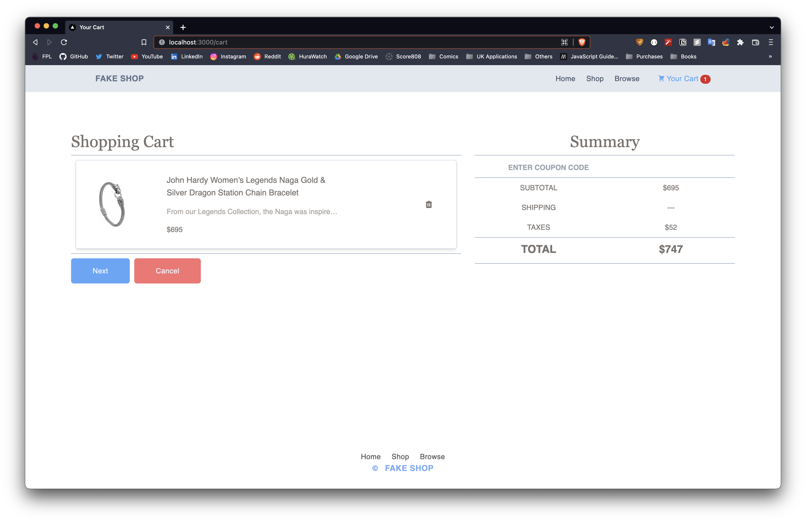

# Fake Store

A Next.js e-commerce website that makes use of the Fake Store API to render products to users. The project web design was gotten from [Moqups](https://app.moqups.com/X1azsw1P3iN9uy4Yyvi0BNkpiVc4IGdF/view?fit_width=1).


## Project Features

- Browse products (all products or by category).
- View product(s) with similar product(s) included.
- Add product(s) to cart.
- Delete product(s) from cart.


## Screenshots







## Run Locally

Clone the project

```bash
  git clone https://link-to-project
```

Go to the project directory

```bash
  cd my-project
```

Install dependencies

```bash
  npm install
```

Start the server

```bash
  npm run dev
```


## Tech Stack

**Client:** React, Next.js, Tailwind CSS.

**Server:** [Fake Store API](https://fakestoreapi.com/docs).

**Others:** Tailwind Styled Components, SWR, react-toastify, react-rating, react-select, and others.

